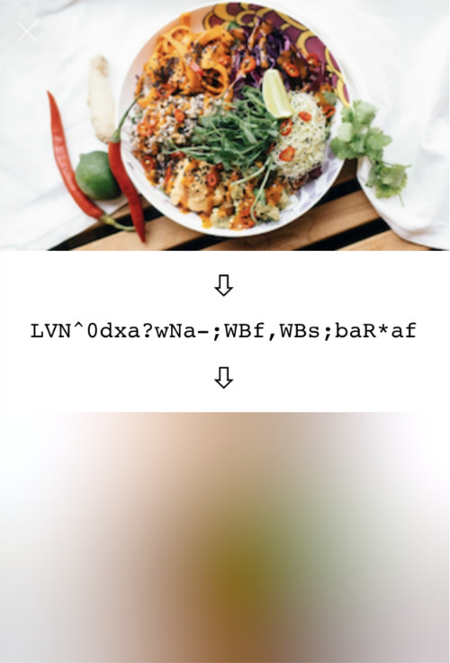
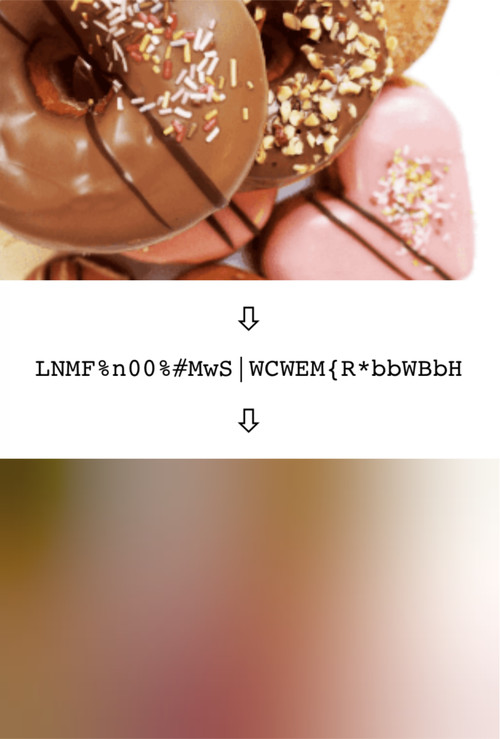

# BlurHashExt

[  ](https://bintray.com/kingsmentor/maven/blurHash/_latestVersion)

Kotlin extensions of [BlurHash](https://blurha.sh/) on Android ImageView, Glide, and Picasso.

Based Blurhash implementation is from https://github.com/woltapp/blurhash. 

This implementation focus on optimizing BlurHash for Android development.


### How BlurHash works?


In short, BlurHash takes an image, and gives you a short string (only 20-30 characters!) that represents the placeholder for this image. You do this on the backend of your service, and store the string along with the image. When you send data to your client, you send both the URL to the image, and the BlurHash string. Your client then takes the string, and decodes it into an image that it shows while the real image is loading over the network. The string is short enough that it comfortably fits into whatever data format you use. For instance, it can easily be added as a field in a JSON object.

### In summary:

&nbsp;&nbsp;&nbsp;

Want to know all the gory technical details? Read the [algorithm description](Algorithm.md).


### Download

Gradle:
```gradle
dependencies {
  implementation 'xyz.belvi:blurHash:blurHash:1.0.4'
}
```

### Usage

#### Step 1 - Initialize BlurHash

`val blurHash: BlurHash = BlurHash(this, lruSize = 20, punch = 1F)`

`lruSize` determines the number of blur drawable that will be cache in memory. The default size is 10

#### Step 2 - Using BlurHash

**With Glide**
```kotlin
    Glide.with(this).load(imgUrl)
    .blurPlaceHolder(blurHashString, imageView, blurHash)
    {
        requestBuilder ->
        requestBuilder.into(imageView)
    }
 ```
 
 or
 
 ```kotlin
    Glide.with(this).load(imgUrl)
    .blurPlaceHolder(blurHashString, width = 200, height= 200, blurHash = blurHash)
    {
        requestBuilder ->
        requestBuilder.into(imageView)
    }
 ```
 
 
**With Picasso**
```kotlin
    Picasso.get().load(imgUrl)
    .blurPlaceHolder(blurHashString, imageView, blurHash)
    {
        request ->
        request.into(imageView)
    }
 ```
 
 or
 
 ```kotlin
    Picasso.get().load(imgUrl)
    .blurPlaceHolder(blurHashString, width = 200, height= 200, blurHash = blurHash)
    {
        request ->
        request.into(imageView)
    }
 ```
 
  
**With Coil**
```kotlin
val request = ImageRequest.Builder(context)
    .data("https://www.example.com/image.jpg")
    .target { drawable ->
        // Handle the result.
        
    }.blurPlaceHolder(blurHashString, imageView, blurHash = blurHash)
    {coilImageBuilder ->
      coilImageBuilder.build()
    }
 ```
 
 or
 
 ```kotlin
imageView.load("https://www.example.com/image.jpg") {
    crossfade(true)
    blurPlaceHolder(blurHashString, imageView, blurHash = blurHash)
    {coilImageBuilder ->
      coilImageBuilder.build()
    }
    transformations(CircleCropTransformation())
}
 ```
 
**In an ImageView**

This is useful for loading a placeholder before makeing a call to load the actual Image
```kotlin
        imageView.placeHolder(blurHashString, blurHash)
        {
            imageView.setImageURI(imgUrl)
        }
 ```
 
  
**Just interested in getting the blurHash Drawabe ?**

This is useful for loading a placeholder before makeing a call to load the actual Image

```kotlin
    blurHashDrawable(blurHashString, imageView, blurHash)
    {
        drawable ->
        // do something with drawable or use whatver imageloading library you want. blurDrawable is ready to be used as error image or placeholder
    }
 ```
 
 or
 
 ```kotlin
    blurHashDrawable(blurHashString, width = 200, height = 200,  blurHash)
    {
        drawable ->
        // do something with drawable or use whatver imageloading library you want. blurDrawable is ready to be used as error image or placeholder
    }
 ```
 
 #### Step 3 - Finally, Disposing
 
On `onDestroy`, do not forget to clean cached bitmap and tell  `BlurHash` to cancel any pending coroutine transaction. Here's how :

```kotlin
    override fun onDestroy() {
        super.onDestroy()
        blurHash.clean()
    }
```

### What is the `punch` parameter in some of these implementations?

It is a parameter that adjusts the contrast on the decoded image. 1 means normal, smaller values will make the effect more subtle,
and larger values will make it stronger. This is basically a design parameter, which lets you adjust the look.

Technically, what it does is scale the AC components up or down.


## Contributing

Contributions are welcomed even to [blurHash base library](https://github.com/woltapp/blurhash/)! 

You can also contribute by reporting issues or helping to resolve issues listed here [issue tracker](https://github.com/kingsmentor/blurhash/issues) or 
file a pull request.
